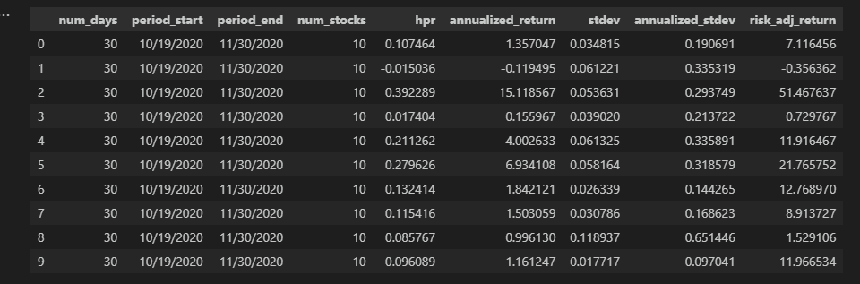
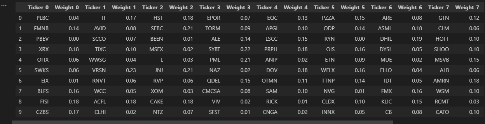
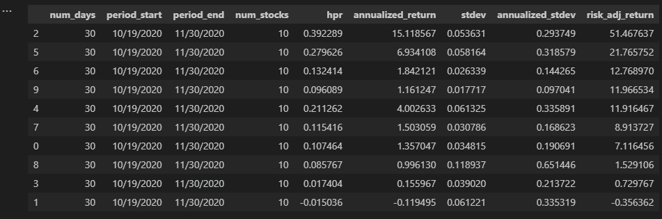
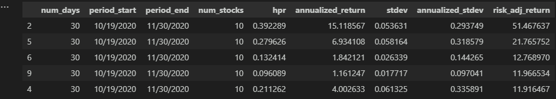
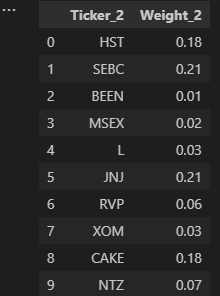

# Efficient Portfolio Data
  ## Description
  This program exists to provide historical data and research regarding what sorts of portfolios
  would have fared well in various time periods, durations, compositions, and sizes over approximately the last 23 years.  Historical data was collected from the yfinance API and written to a master CSV file, which then is randomly sampled and converted to dataframes with parameters such as size, start date, duration, and compared to a benchmark for that same period.

  Results with the portfolio of random tickers are then randomly weighted to equal 100%, and these portfolios can be run multiple times to generate many random portfolios for a period and compared against the benchmark.  Finally, the results are stored and displayed, with additional dataframes that show which (if any) of the randomized portfolios managed to outperform the benchmark across key metrics such as risk-adjusted return, annualized return, or annualized volatility.

  --Future state--
  * I hope to make improvements to the program that will graph large quantities of these randomized portfolios so that users can visually see the impact of portfolio size, duration, and time period on likelihood of benchmark outperformance.

  * I hope to include a feature that will assess the impact of buying and selling shares of holdings during the holding period, to make the comparison more applicable to real-world portfolios.  This would ideally include after-tax return figures, given certain tax rate assumptions, and be smart enough to track cost basis for capital gains and losses.
  

  ## License
  

  ## Table of Contents
  1. [Installation](##Installation)
  2. [Deployment](#Deployment)
  3. [Usage](#Usage)
  4. [Screenshots](#Screenshots)
  5. [Contributing](#Contributing)
  6. [Technologies](#Technologies)
  7. [Tests](#Tests)
  8. [Questions](#Questions)

  ## Installation
  * You will need to have Python and certain libraries installed before running the program.
    * yfinance
    * pandas
    * numpy
    * os
    * jupyter notebook (or extension for vscode, etc).

  * The program reads a CSV file that was too large to commit to GitHub, and as of
  12/2/2023 I have yet to get lfs to work properly and push to this repo from local so that
  the CSV can be read.  So if you want to run the program, contact me and I will send you 
  all_history.csv, which will need to be located at the root directory.
  

  ## Deployment
  No Live Deployment exists for this repo.

  ## Usage
  The program is intended to serve as a way to get ideas about how portfolio composition impacts likelihood of outperforming a benchmark.  The Portfolio class can be run many times using different metrics like starting point, size, and number of stocks, to help users identify how changing these inputs might optimize for their desired time horizon and risk tolerance, and what randomized sample portfolios have historically done with similar parameters.

  The program should also be able to approximate at what level a randomized portfolio would achieve significant diversification compared to a benchmark, and because it will return the randomized tickers and weights used in the comparisons, it can be used as a starting point for crafting a similar portfolio.
  

  ## Screenshots
  Below are some examples of what dataframes the program will produce:

  The Individual Portfolio Output Dataframes that are aggregated when run n number of times
  (with parameters such as start date, length in days, and number of stocks randomly generated):
  

  The Composition Dataframes with a list of tickers and weights used for each portfolio generated:
  
  
  The summary statistics dataframe containing key performance metrics for each of the portfolios:
  

  The Filtered Dataframe containing those portfolios which outperformed their benchmarks:
  

  The Filtered Dataframe containing te top n number of portfolios and their compositions:
  

  ## Contributing
  Please feel free to contact me if you have questions about contributing to this project.  You can reach out via my email or GirHub account linked below.

  ## Technologies
  * Python
  * Pandas
  * JuPyter Notebooks
  * VSCode and Jupyter plugin
  * YFinance API
  * Numpy

  ## Tests
  No testing frameworks were used in the development of this project, and it does not contain test files.

  ## Questions
  [Check out my GitHub](https://github.com/LumberJon1)
  --or--
  Email me at JWilliams12117@gmail.com
